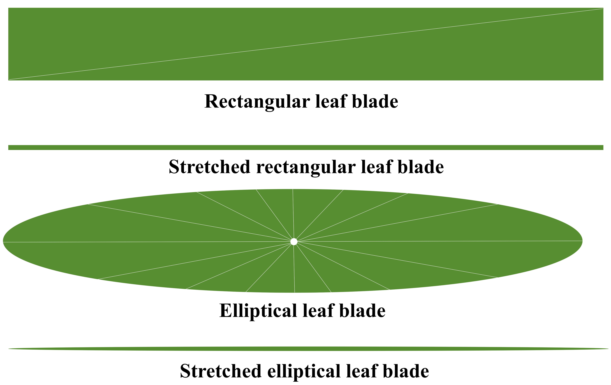
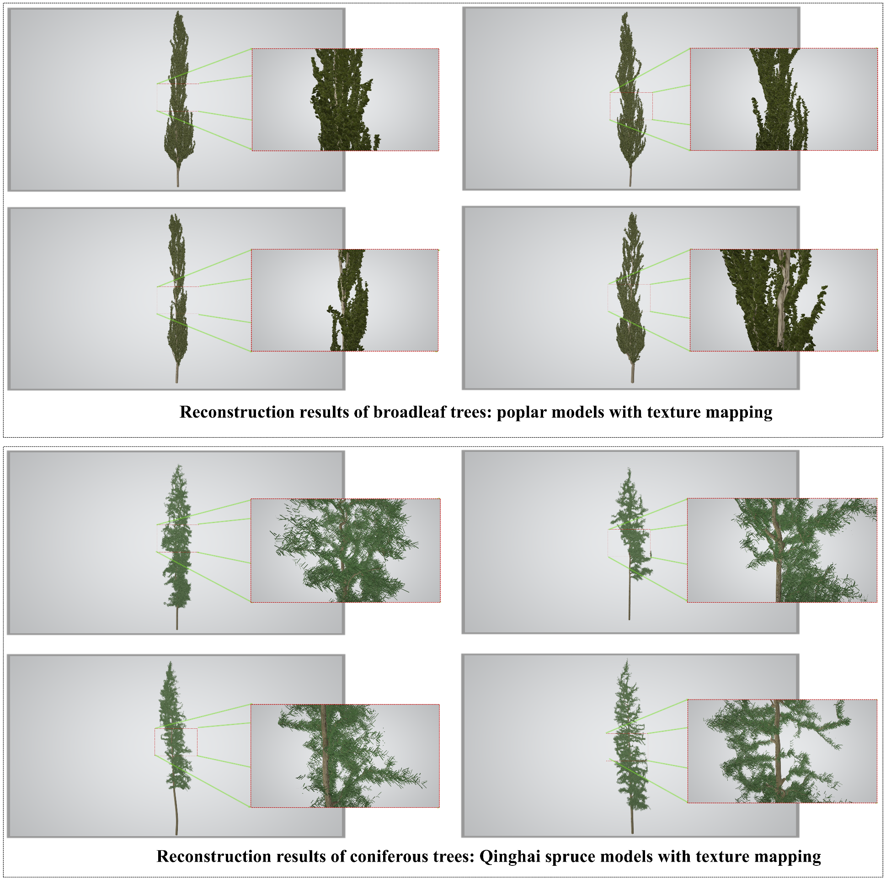
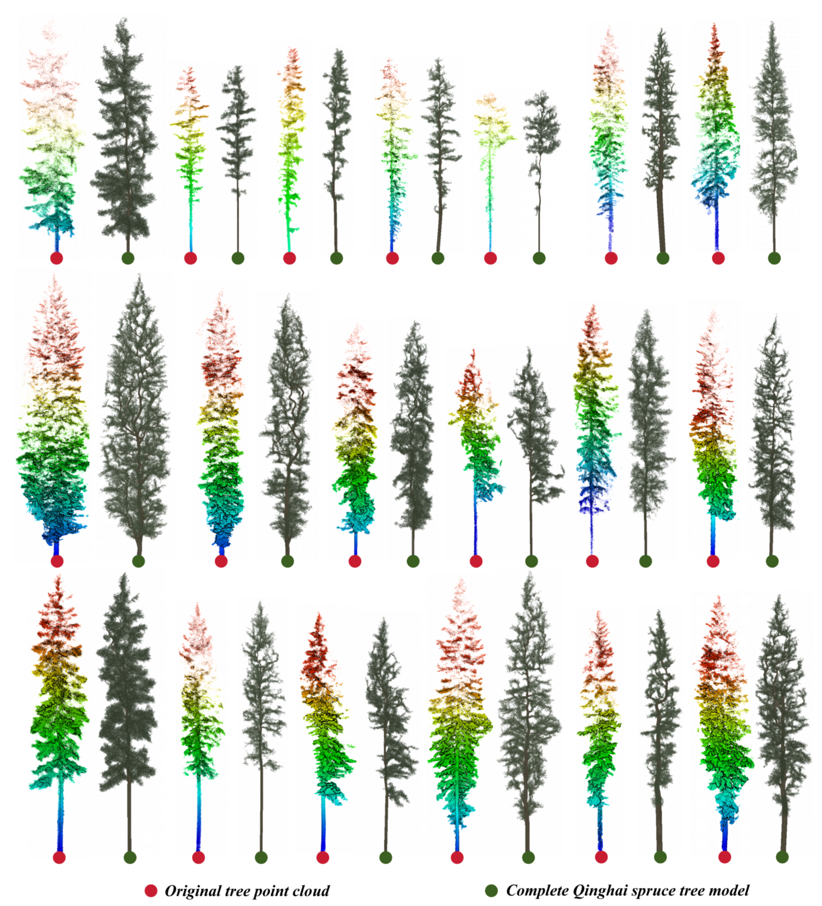

# Adaptive Leaf Synthesis Algorithm (ALSA)
The Adaptive Leaf Synthesis Algorithm (ALSA) is a parameterized leaf synthesis tool for three-dimensional tree reconstruction. It is designed to generate complete foliage-added individual tree models from trunk–branch OBJ models. The algorithm can be used for three-dimensional forest scene reconstruction, visual representation, and three-dimensional radiative transfer simulation. It takes a reconstructed trunk–branch OBJ mesh model as input and generates parameterized leaf structures for simulation and visualization through branch-structure-constrained extraction of candidate leaf attachment points, user-defined leaf-shape parameters, density regulation, and randomized spatial placement strategies.


## Algorithm Overview
The basic workflow of ALSA includes:
Reading the trunk–branch OBJ model;
Parsing mesh vertices and faces;
Identifying candidate leaf attachment positions from fine-branch regions;
Reducing local leaf over-aggregation through a minimum-spacing constraint;
Generating parameterized leaf primitives;
Placing leaves in three-dimensional space based on positional perturbation, azimuth, and inclination controls;
Exporting the complete foliage-added individual tree OBJ model;
Saving woody structures and leaf structures as separate OBJ groups.

<p align="center">
  
</p>

<p align="center">
  <b>Figure 1.</b> Overall workflow of the Adaptive Leaf Synthesis Algorithm (ALSA).
</p>


## Main Features

* Generates complete foliage-added 3D individual-tree models from trunk–branch OBJ mesh models;
* Supports rectangular leaf cards and elliptical triangular-fan leaf primitives;
* Can be used for foliage-structure simulation of both coniferous and broadleaf trees;
* Identifies candidate leaf attachment regions on fine branches using KD-tree-based local neighborhood analysis;
* Allows foliage density regulation through local thickness thresholds, minimum spacing between attachment points, and the number of leaves generated at each attachment point;
* Supports both batch processing and single-tree processing;
* Outputs OBJ files containing independent `stem_branch` and `leaves` groups;
* Automatically reports the generated leaf number and total leaf area;
* Supports unified Z-up orientation and tree-base elevation normalization.

## Methodological Principle

ALSA adopts a branch-structure-constrained parametric foliage synthesis strategy. The algorithm takes a trunk–branch OBJ model containing mesh vertices and faces as input. In the associated study, the trunk–branch models were generated using the AdQSM algorithm, but ALSA itself is not limited to AdQSM-derived models. The algorithm has also been tested on trunk–branch models reconstructed using SmartQSM, developed by Yang et al. from the AI&VIS team. As long as the input OBJ file can reasonably represent trunk and branch structures, it can be used as input for ALSA.

The output of ALSA is a complete foliage-added individual-tree OBJ model. The output model contains two clearly separated components:

* `stem_branch`: woody structures, including trunks and branches;
* `leaves`: synthesized foliage structures.

This component-separated design facilitates the assignment of different material or optical properties to woody structures and foliage structures in LESS, DART, Blender, or other 3D modeling and radiative transfer software.


## Leaf Primitive Types

ALSA currently supports two basic types of leaf primitives.

### 1. Rectangular Leaf Primitive

In rectangular mode, each leaf is represented as a planar quadrilateral leaf card consisting of 4 vertices and 2 triangular faces. This mode has low geometric complexity and is suitable for rapidly constructing needle-like, strip-like, or elongated leaves.

Typical applicable cases include:

* spruce needles;
* coniferous foliage structures;
* strip-like leaves;
* large-scale lightweight 3D forest scene construction.

### 2. Elliptical Leaf Primitive

In elliptical mode, each leaf is represented as a triangular-fan mesh. The algorithm first defines the leaf center point, then generates multiple boundary vertices along the elliptical outline, and finally connects these boundary vertices to the center point to form triangular faces.

Typical applicable cases include:

* poplar leaves;
* broadleaf tree leaves;
* elliptical or nearly circular leaves;
* leguminous plant leaves;
* broadleaf forms with relatively smooth margins.

<p align="center">

</p>

<p align="center">
  <b>Figure 2.</b> Parameterized leaf primitives used in ALSA.
</p>

---

## Example Results

By adjusting leaf-shape parameters and spatial layout parameters, ALSA can generate 3D tree models with different species-specific characteristics or leaf morphological features.

<p align="center">
 
</p>

<p align="center">
  <b>Figure 3.</b> Tree reconstruction results under different leaf-shape parameters and spatial layout parameters.
</p>


The individual-tree models generated by ALSA can be further used to construct plot-scale or stand-scale 3D forest scenes.


<p align="center">

</p>

<p align="center">
  <b>Figure 4.</b> Three-dimensional reconstruction results of Chinese white poplar and Qinghai spruce after material assignment.
</p>

<p align="center"> 

</p>

<p align="center">
<b>Figure 5.</b> Comparison between the reconstructed complete Qinghai spruce model and the original point cloud.

</p> <p align="center">  
</p> <p align="center">
<b>Figure 6.</b> Complete Qinghai spruce plot constructed from the reconstructed models and the corresponding 3D radiative transfer simulation results. 
</p>


## Installation

ALSA is implemented in Python. The current version requires only two external scientific-computing packages: `numpy` and `scipy`.

Python 3.10 or later is recommended.

### Environment Requirement

```text
Python >= 3.10
```

### Required Dependencies

```text
numpy
scipy
```

### Install Dependencies

Users can install the required dependencies directly using:

```bash
pip install numpy scipy
```

### Project Files

Please make sure that the following Python files are placed in the same project directory:

```text
run_alsa.py
config.py
pipeline.py
mesh_io.py
leaf_model.py
transforms.py
```

The entry point of ALSA is:

```bash
python run_alsa.py
```

In most cases, users only need to modify the parameters in `run_alsa.py`. The other modules contain the default configuration, OBJ input/output, leaf primitive generation, candidate attachment-point extraction, foliage synthesis, coordinate transformation, and the main processing workflow.

No additional 3D modeling libraries are required for the core ALSA workflow. The algorithm reads trunk–branch OBJ files, generates parametric foliage primitives, and exports foliage-added OBJ models using Python file operations together with `numpy` and `scipy`.

Generated OBJ models can be visualized or further processed in external software such as Blender, MeshLab, CloudCompare, LESS, or DART.


## Usage

### 1. Configure Runtime Parameters

Open `run_alsa.py` and modify the input/output paths and foliage synthesis parameters.

Batch-processing mode:

```python
cfg.PROCESS_MODE = "BATCH"
cfg.INPUT_ROOT = r"path\to\input_obj_folder"
cfg.OUTPUT_ROOT = r"path\to\output_folder"
cfg.OBJ_GLOB = "*.obj"
cfg.RECURSIVE = True
```

Single-tree processing mode:

```python
cfg.PROCESS_MODE = "SINGLE"
cfg.SINGLE_INPUT_OBJ = r"path\to\single_tree.obj"
cfg.SINGLE_OUTPUT_OBJ = r"path\to\output_tree.obj"
```

### 2. Select the Leaf Primitive Type

For coniferous trees or narrow strip-like leaves, rectangular leaf primitives are recommended:

```python
cfg.LEAF_SHAPE = "RECTANGLE"

cfg.RECT_LEAF_LENGTH = 0.025
cfg.RECT_LEAF_WIDTH = 0.002
cfg.RECT_LEAF_SIZE_RANDOMNESS = 0.15
```

For broadleaf trees, elliptical leaf primitives are recommended:

```python
cfg.LEAF_SHAPE = "ELLIPSE"

cfg.ELLIPSE_LEAF_LENGTH = 0.08
cfg.ELLIPSE_LEAF_WIDTH = 0.06
cfg.ELLIPSE_LEAF_SIZE_RANDOMNESS = 0.15
cfg.ELLIPSE_LEAF_SEGMENTS = 12
```

After modifying leaf-shape-related parameters, update the active leaf parameters:

```python
cfg.update_active_leaf_params()
```

### 3. Adjust Foliage Density

The main parameters for controlling foliage density are:

```python
cfg.NUM_LEAVES_PER_BRANCH = 1
cfg.RADIUS_THRESHOLD = 0.01
cfg.MIN_CLUSTER_SPACING = 0.02
cfg.ATTACH_JITTER = 0.002
```

Parameter description:

| Parameter                 | Description                                                                  |
| ------------------------- | ---------------------------------------------------------------------------- |
| `NUM_LEAVES_PER_BRANCH`   | Number of leaf primitives generated at each retained attachment point        |
| `RADIUS_THRESHOLD`        | Local mesh-spacing threshold used to identify candidate fine-branch vertices |
| `MIN_CLUSTER_SPACING`     | Minimum distance between retained leaf attachment points                     |
| `ATTACH_JITTER`           | Random perturbation amplitude of the leaf attachment position                |
| `Z_ANGLE_RANGE`           | Azimuth rotation range                                                       |
| `INCLINATION_ANGLE_RANGE` | Inclination angle range                                                      |
| `RANDOM_SEED`             | Random seed used to ensure reproducible random leaf generation               |

### 4. Run ALSA

```bash
python run_alsa.py
```

---

## Input Data

The input file should be a trunk–branch OBJ model.

The OBJ file should contain:

* mesh vertices;
* mesh faces;
* woody structures consisting of trunks and branches.

Although the trunk–branch OBJ models used in the associated study were generated using AdQSM, ALSA can also be applied to trunk–branch OBJ models from other sources, provided that their mesh structures are suitable for leaf attachment-point identification.

---

## Output

ALSA outputs a complete foliage-added individual-tree OBJ model.

The output OBJ file contains two independent groups by default:

```text
g stem_branch
g leaves
```

During execution, the program reports the number of generated leaves and the total leaf area. The current console output is:

```text
Number of generated leaves: xxxx
Total leaf area: xx.xxxxxx m²
```

In batch-processing mode, the program also reports the total number of generated leaves and the total leaf area across all processed trees:

```text
Total number of generated leaves after batch modeling: xxxx
Total leaf area after batch modeling: xx.xxxxxx m²
```

In single-tree processing mode, the program reports:

```text
Total number of generated leaves after single-tree modeling: xxxx
Total leaf area after single-tree modeling: xx.xxxxxx m²
```

```

---

## Main Parameter Description

| Parameter                      |   Unit | Description                                                                    |
| ------------------------------ | -----: | ------------------------------------------------------------------------------ |
| `PROCESS_MODE`                 |      - | Processing mode, either `BATCH` or `SINGLE`                                    |
| `INPUT_ROOT`                   |      - | Input folder for batch processing                                              |
| `OUTPUT_ROOT`                  |      - | Output folder for batch or single-tree processing                              |
| `OBJ_GLOB`                     |      - | Filename-matching pattern for input OBJ files                                  |
| `RECURSIVE`                    |   bool | Whether to recursively search subfolders under `INPUT_ROOT`                    |
| `SINGLE_INPUT_OBJ`             |      - | Input OBJ file path for single-tree processing                                 |
| `SINGLE_OUTPUT_OBJ`            |      - | Output OBJ file path for single-tree processing                                |
| `STEM_GROUP`                   |      - | OBJ group name for woody structures                                            |
| `LEAF_GROUP`                   |      - | OBJ group name for synthesized foliage structures                              |
| `LEAF_SHAPE`                   |      - | Leaf primitive type, either `RECTANGLE` or `ELLIPSE`                           |
| `RECT_LEAF_LENGTH`             |      m | Length of the rectangular leaf card                                            |
| `RECT_LEAF_WIDTH`              |      m | Width of the rectangular leaf card                                             |
| `RECT_LEAF_SIZE_RANDOMNESS`    |      - | Random size variation applied to rectangular leaves                            |
| `ELLIPSE_LEAF_LENGTH`          |      m | Major-axis length of the elliptical leaf primitive                             |
| `ELLIPSE_LEAF_WIDTH`           |      m | Minor-axis width of the elliptical leaf primitive                              |
| `ELLIPSE_LEAF_SIZE_RANDOMNESS` |      - | Random size variation applied to elliptical leaves                             |
| `ELLIPSE_LEAF_SEGMENTS`        |      - | Number of boundary segments used to discretize the elliptical leaf primitive   |
| `LEAF_LENGTH`                  |      m | Internal active leaf length selected by `update_active_leaf_params()`          |
| `LEAF_WIDTH`                   |      m | Internal active leaf width selected by `update_active_leaf_params()`           |
| `LEAF_SIZE_RANDOMNESS`         |      - | Internal active leaf-size randomness selected by `update_active_leaf_params()` |
| `LEAF_SEGMENTS`                |      - | Internal active segment number selected by `update_active_leaf_params()`       |
| `NUM_LEAVES_PER_BRANCH`        |      - | Number of leaf primitives generated at each retained attachment point          |
| `RADIUS_THRESHOLD`             |      m | Local mesh-spacing threshold used to identify candidate fine-branch vertices   |
| `MIN_CLUSTER_SPACING`          |      m | Minimum spacing between retained leaf attachment points                        |
| `ATTACH_JITTER`                |      m | Random perturbation amplitude of the leaf attachment position                  |
| `Z_ANGLE_RANGE`                | degree | Sampling range of the azimuth rotation angle                                   |
| `INCLINATION_ANGLE_RANGE`      | degree | Sampling range of the inclination angle                                        |
| `RANDOM_SEED`                  |      - | Ensures reproducible random leaf generation                                    |
| `DO_ZUP`                       |   bool | Whether to convert the model to a Z-up orientation                             |
| `UP_MODE`                      |      - | Original upward-axis direction of the input model                              |
| `GROUND_TO_Z0`                 |   bool | Whether to translate the lowest point of the model to Z = 0                    |

---

## Leaf Area

The total leaf area generated by ALSA mainly depends on:

```text
number of retained leaf attachment points
× number of leaves generated at each attachment point
× area of a single leaf primitive
```

For rectangular leaf cards, the area of a single leaf is approximately:

```text
leaf length × leaf width
```

For elliptical leaf primitives, the leaf area is estimated from the triangular-fan geometry and is close to:

```text
π × leaf length × leaf width / 4
```

The generated total leaf area can be used to adjust foliage density parameters so that the reconstructed model remains broadly consistent with plot-scale canopy conditions or the target LAI.


## Default Parameter Settings in the Current Code

The following settings correspond to the current default configuration in `run_alsa.py` and `config.py`.

### Current Leaf Shape

```python
cfg.LEAF_SHAPE = "RECTANGLE"
```
### Rectangular Leaf Parameters

```python
cfg.RECT_LEAF_LENGTH = 0.055
cfg.RECT_LEAF_WIDTH = 0.003
cfg.RECT_LEAF_SIZE_RANDOMNESS = 0.15
```
### Elliptical Leaf Parameters

```python
cfg.ELLIPSE_LEAF_LENGTH = 0.07
cfg.ELLIPSE_LEAF_WIDTH = 0.06
cfg.ELLIPSE_LEAF_SIZE_RANDOMNESS = 0.15
cfg.ELLIPSE_LEAF_SEGMENTS = 12
```

After modifying `LEAF_SHAPE` or any leaf-size-related parameters, the active leaf parameters must be updated:

```python
cfg.update_active_leaf_params()
```

### Foliage Density and Spatial Placement Parameters

```python
cfg.NUM_LEAVES_PER_BRANCH = 4
cfg.RADIUS_THRESHOLD = 0.03
cfg.MIN_CLUSTER_SPACING = 0.005
cfg.ATTACH_JITTER = 0.002
cfg.Z_ANGLE_RANGE = (355, 360)
cfg.INCLINATION_ANGLE_RANGE = (60, 60.5)
cfg.RANDOM_SEED = 42
```

### Orientation and Ground Normalization Parameters

```python
cfg.DO_ZUP = True
cfg.UP_MODE = "Z"
cfg.GROUND_TO_Z0 = True
```

These parameters can be further adjusted according to species-specific leaf morphology, input OBJ resolution, canopy density, target leaf area, or target LAI.

---

## Notes

* ALSA is a parametric foliage synthesis algorithm, not a method for directly reconstructing real individual leaves.
* The quality of the output model depends strongly on the quality of the input trunk–branch OBJ model.
* `RADIUS_THRESHOLD` is a mesh-spacing-based proxy used to identify geometrically fine branch regions. It should not be interpreted as the real branch radius.
* `MIN_CLUSTER_SPACING` controls the minimum distance between retained leaf attachment points, rather than the visual distance between leaf tips.
* `NUM_LEAVES_PER_BRANCH` controls the number of leaf primitives generated at each retained attachment point, not the number of leaves on each real branch.
* `ELLIPSE_LEAF_SEGMENTS` must not be smaller than `8`; otherwise, the program will raise an error.
* For large-scale forest scene construction, rectangular leaf cards are more memory- and storage-efficient than high-segment elliptical leaf primitives.
* If the input OBJ file is large, an excessively high value of `ELLIPSE_LEAF_SEGMENTS` is not recommended.
* If strict control of the total leaf area is required, `RECT_LEAF_SIZE_RANDOMNESS` or `ELLIPSE_LEAF_SIZE_RANDOMNESS` should be reduced or set to `0`.
* If the trunk–branch model is sparse, the leaf size can be moderately increased to improve visual continuity, especially for coniferous trees.
* When `DO_ZUP = True` and `GROUND_TO_Z0 = True`, ALSA converts the model to a Z-up orientation and translates the lowest point of the model to Z = 0. The current pipeline also recenters the tree base in the horizontal plane.
* The current version of ALSA provides basic control of leaf placement and orientation. More advanced strategies, including leaf inclination angle regulation and layer-specific LAI-based foliage density control, are still being optimized.


---


## Citation

If you use ALSA in your research, please cite the associated paper or the corresponding software release.

```bibtex
@article{Lian2026ALSA,
  title   = {Tree-neighborhood scale structure--radiation coupling analysis and modeling using multi-source remote sensing and ensemble learning},
  author  = {Lian, Guanjun and Zhang, Huaiqing and Liu, Hua and Yang, Tingdong and Qiu, Hanqing and Liu, Yang and others},
  journal = {To be updated},
  year    = {2026}
}
```

The formal citation information will be updated once the associated paper has been published.


---


## License

This project is released under the MIT License. This license permits reuse, modification, and distribution of the code, provided that the original copyright notice and license terms are retained.


---

## Contact

If you have any questions or suggestions, please feel free to contact the project maintainer at:
```text
Name: Guanjun Lian
Email: 1669835441@qq.com
Institution: Institute of Forest Resource Information Techniques, Chinese Academy of Forestry, Beijing 100091, China
```


---

## Acknowledgements

This project is designed for 3D tree reconstruction and radiative transfer simulation based on trunk–branch OBJ models. In the associated study, the trunk–branch models were generated using AdQSM. The foliage-added 3D tree models generated by ALSA can be further used for visual representation and 3D radiative transfer simulation.

